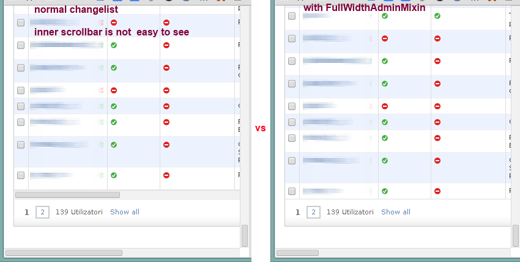

===========================
    django-admin-utils
===========================

.. image:: http://img.shields.io/travis/ionelmc/django-admin-utils/master.png
    :alt: Travis-CI Build Status
    :target: https://travis-ci.org/ionelmc/django-admin-utils

.. image:: https://ci.appveyor.com/api/projects/status/<security-token>/branch/master
    :alt: AppVeyor Build Status
    :target: https://ci.appveyor.com/project/ionelmc/django-admin-utils

.. image:: http://img.shields.io/coveralls/ionelmc/django-admin-utils/master.png
    :alt: Coverage Status
    :target: https://coveralls.io/r/ionelmc/django-admin-utils

.. image:: http://img.shields.io/pypi/v/django-admin-utils.png
    :alt: PYPI Package
    :target: https://pypi.python.org/pypi/django-admin-utils

.. image:: http://img.shields.io/pypi/dm/django-admin-utils.png
    :alt: PYPI Package
    :target: https://pypi.python.org/pypi/django-admin-utils

Utility code and patterns. 

Requirements
============

:OS: Any
:Runtime: Python 2.6, 2.7, 3.2, 3.3 or PyPy
:Packages: Django>=1.4 (including 1.7); Django>=1.1 probably works but it's not tested, those releases should not be used (they are insecure).

Terse admin.py
==============

::

    from django.contrib import admin
    from admin_utils import register, inline

    from .models import MyModel, OtherModel

    @register(MyModel)
    class MyModelAdmin(admin.ModelAdmin):
        inlines = inline(OtherModel),

If you want custom admin sites::

    customsite = admin.AdminSite()

    @register(MyModel, site=customsite)
    class MyModelAdmin(admin.ModelAdmin):
        inlines = inline(OherModel),

Mock admin (mount your views in admin using model wrappers)
===========================================================

Have you ever wanted a page in the admin that appears in the app list but you don't have any
models ? Now you can have that without patching up the admin Site or the templates. Just put this
in your admin.py::

    from django.conf.urls import patterns, url
    from admin_utils import make_admin_class

    make_admin_class("Test1", patterns("test_app.views",
        url(r'^$', 'root', name='test_app_test1_changelist'),
        url(r'^level1/$', 'level1', name='level-1'),
        url(r'^level1/level2/$', 'level2', name='level-2'),
    ), "test_app")

To use different admin site::

    make_admin_class("Test1", patterns("test_app.views",
        url(r'^$', 'root', name='test_app_test1_changelist'),
        url(r'^level1/$', 'level1', name='level-1'),
        url(r'^level1/level2/$', 'level2', name='level-2'),
    ), "test_app", site=customsite)

Admin mixins
============

admin_utils.mixins.FoldableListFilterAdminMixin
-----------------------------------------------

Adds nice filter toggling with cookie support. Largely based on `django-foldable-list-filter
<https://bitbucket.org/Stanislas/django-foldable-list-filter>`_ but without the transition effect and no pictures.

Example::

    from admin_utils.mixins import FoldableListFilterAdminMixin

    class MyModelAdmin(FoldableListFilterAdminMixin, admin.ModelAdmin):
        pass

Looks like this:

    .. image:: docs/FoldableListFilterAdminMixin.png
       :alt: Screenshort of FoldableListFilterAdminMixin

admin_utils.mixins.FullWidthAdminMixin
--------------------------------------

Make the changelist expand instead of having the width of the windows and having that nasty inner scrollbar. You never gonna notice that if
your table is long !

Example::

    from admin_utils.mixins import FoldableListFilterAdminMixin

    class MyModelAdmin(FoldableListFilterAdminMixin, admin.ModelAdmin):
        pass

You probably didn't even notice you had this problem:

